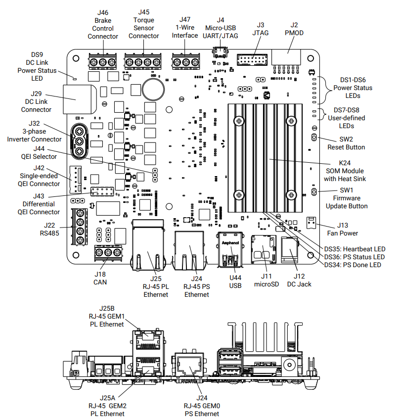
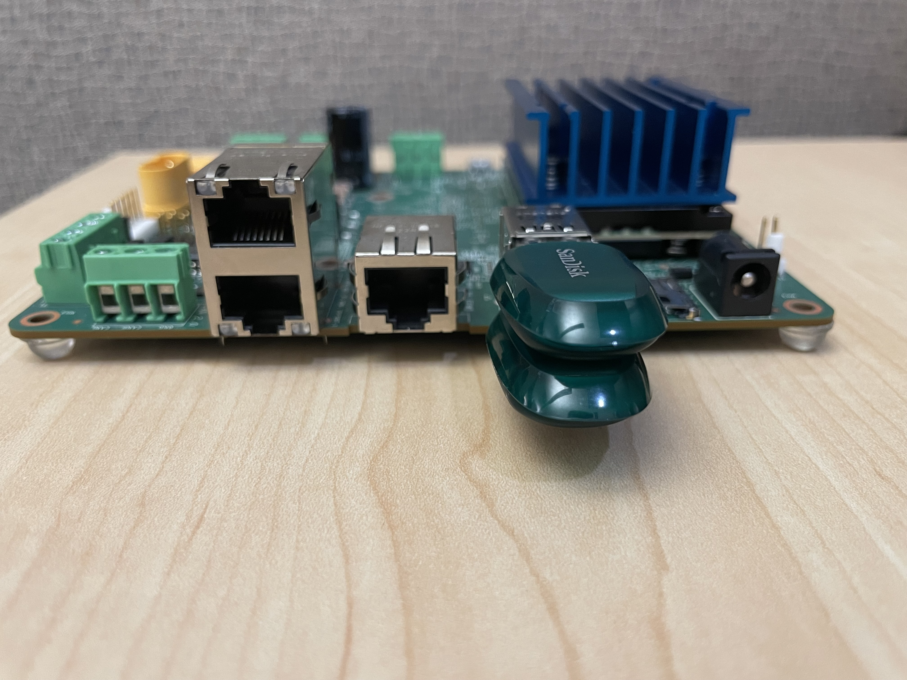
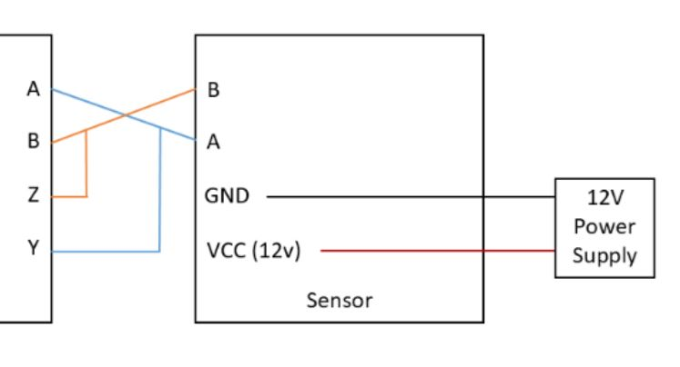
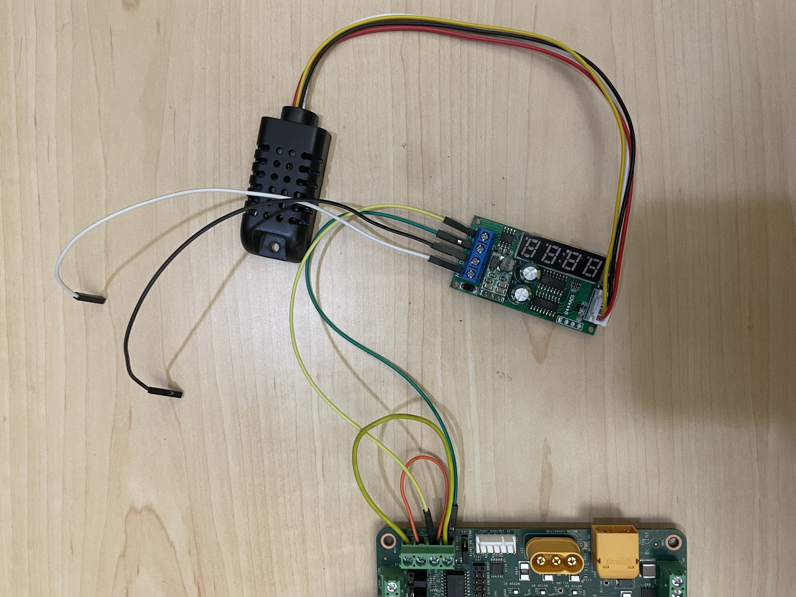
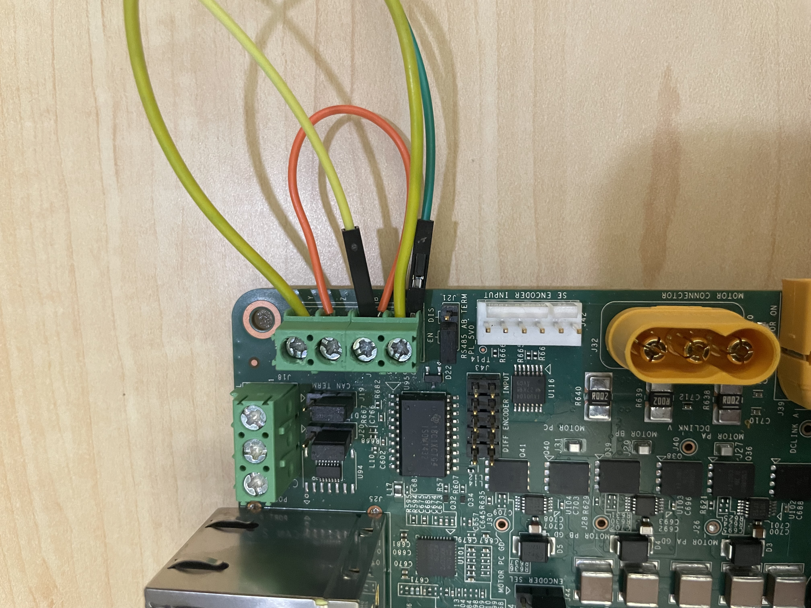
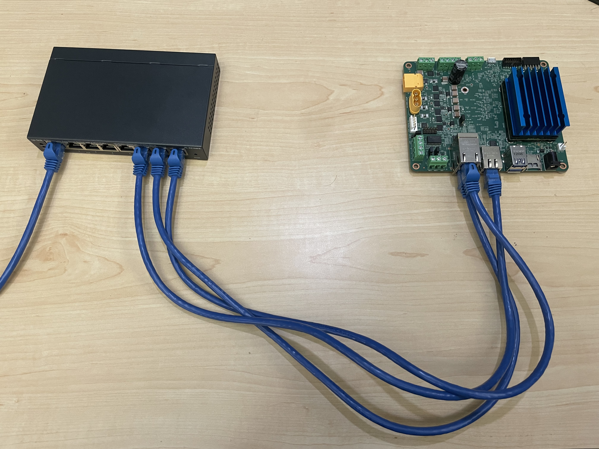
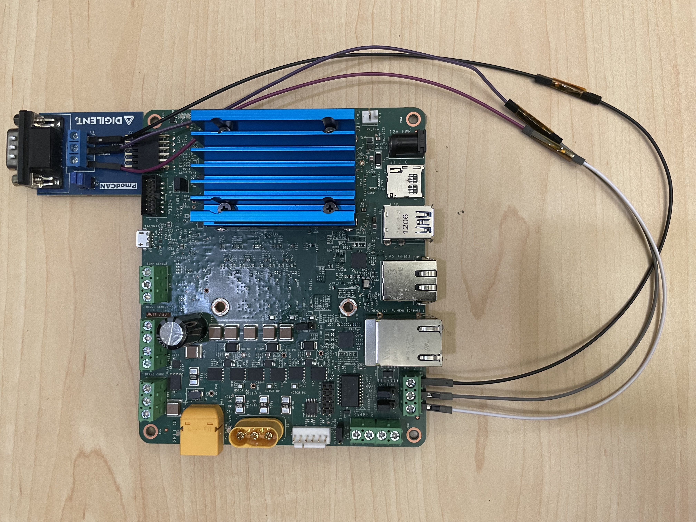
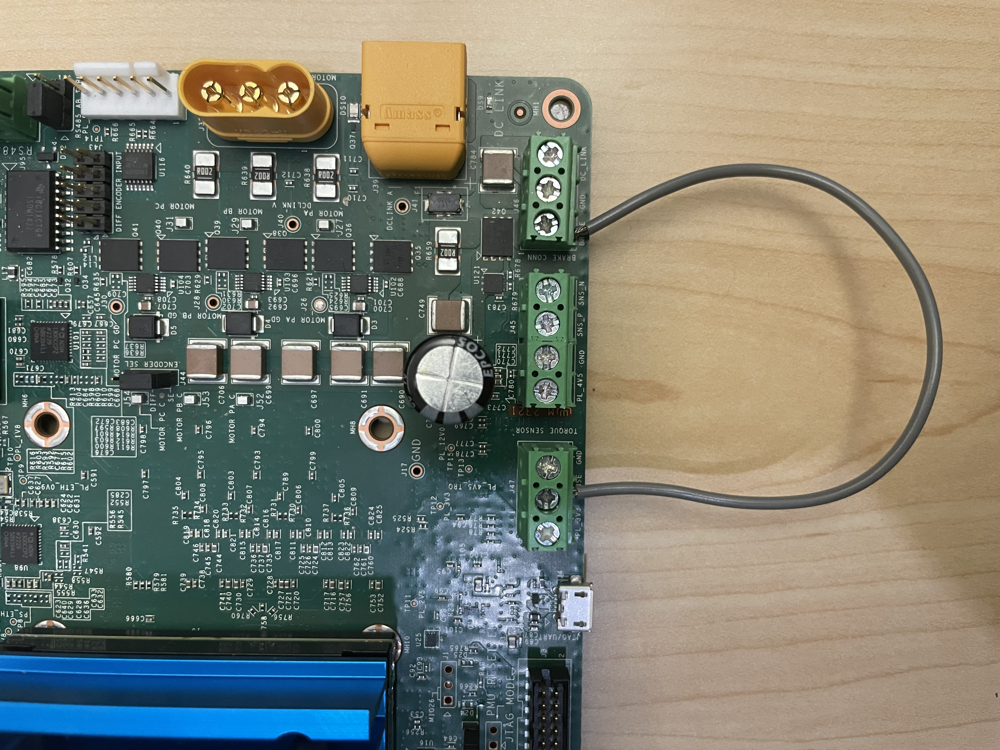
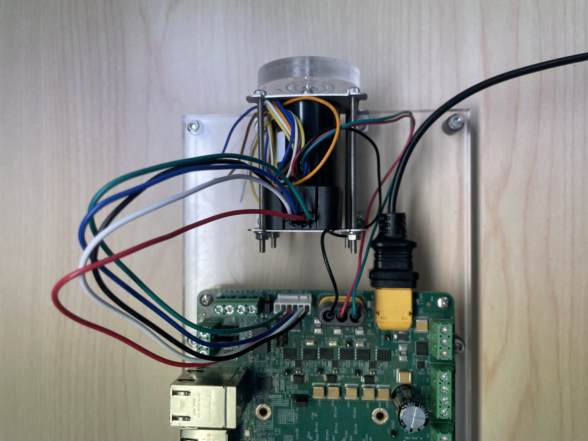
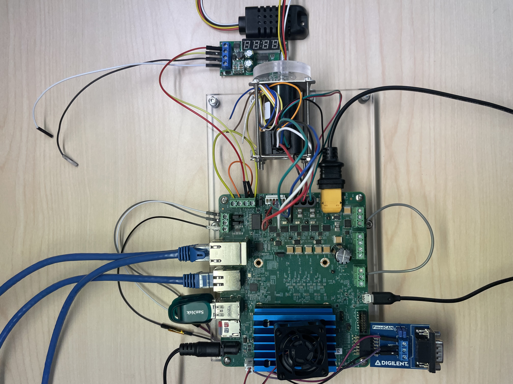

# KD240 BIST Board Setup

## Hardware Requirements

1. KD240 Starter Kit [here](http://www.amd.com/kd240)
2. KD240 Power Supply & Adapter
3. KD240 Motor Kit [here](http://www.amd.com/kd240)
4. 24V Power Supply for Motor Kit
5. MicroSD Card
6. Host Machine (Windows or Ubuntu)
7. Three Ethernet Cables
8. Ethernet Switch
9. One [PMOD CAN](https://digilent.com/reference/pmod/pmodcan/start)
10. 10 Male to Male,Female to Female,Female to Male Jumper Wires
11. One RS485 Temperature and Humidity Sensor from [here](https://www.aliexpress.us/item/2251832868368800.html?gatewayAdapt=glo2usa4itemAdapt) or [here](https://www.amazon.com/Temperature-Humidity-Sensor-Display-Modbus/dp/B078NRYBVZ)
12. Two USB Flash Drives

## Board Setup

This page shows how to set up the KD240 before running the BIST application.

Refer to the KD240 Board and the Interface layout below for connector reference numbers:

Test case mapping to board interfaces:

| Interface                                       | External Hardware                                                                         | Test Module | Test Case                             |
|-------------------------------------------------|-------------------------------------------------------------------------------------------|-------------|---------------------------------------|
| CAN - J18, PMOD - J2                            | MCP25625 PMOD CAN, 3x Male-Male Jumper Wires                                              | CAN         | can_bus_send                          |
| CAN - J18, PMOD - J2                            | MCP25625 PMOD CAN, 3x Male-Male Jumper Wires                                              | CAN         | can_bus_receive                       |
| USB3.0 (Top port) - U44                         | USB Flash Drive                                                                           | Disk        | usb1_read_performance                 |
| USB3.0 (Top port) - U44                         | USB Flash Drive                                                                           | Disk        | usb1_write_performance                |
| USB3.0 (Bottom port) - U44                      | USB Flash Drive                                                                           | Disk        | usb2_read_performance                 |
| USB3.0 (Bottom port) - U44                      | USB Flash Drive                                                                           | Disk        | usb2_write_performance                |
| MicroSD port - J11                              | MicroSD Card                                                                              | Disk        | sd_read_performance                   |
| MicroSD port - J11                              | MicroSD Card                                                                              | Disk        | sd_write_performance                  |
| SOM EEPROM                                      | None                                                                                      | EEPROM      | som_eeprom                            |
| Carrier Card EEPROM                             | None                                                                                      | EEPROM      | carrier_card_eeprom                   |
| GEM1 PL RJ45 Ethernet - J25B                    | Ethernet Cable                                                                            | Ethernet    | ethernet1_ping                        |
| GEM1 PL RJ45 Ethernet - J25B                    | Ethernet Cable                                                                            | Ethernet    | ethernet1_perf                        |
| GEM2 PL RJ45 Ethernet - J25A                    | Ethernet Cable                                                                            | Ethernet    | ethernet2_ping                        |
| GEM2 PL RJ45 Ethernet - J25A                    | Ethernet Cable                                                                            | Ethernet    | ethernet2_perf                        |
| GEM0 PS RJ45 Ethernet - J24                     | Ethernet Cable                                                                            | Ethernet    | ethernet3_ping                        |
| GEM0 PS RJ45 Ethernet - J24                     | Ethernet Cable                                                                            | Ethernet    | ethernet3_perf                        |
| Brake Connector - J46, 1-Wire Interface -   J47 | Male-Male Jumper Wire                                                                     | GPIO        | brake_ctrl_1wire_loopback             |
| PS I2C Main Bus                                 | None                                                                                      | I2C         | ps_i2c_bus_main                       |
| INA260                                          | None                                                                                      | IIO         | ina260_current                        |
| Single-ended QEI Connector - J42                | Motor Kit with 24V Power Supply                                                           | Motor       | qei_gate_drive_test                   |
| 3-phase Inverter Connector - J32                | Motor Kit with 24V Power Supply                                                           | Motor       | volt_adc_fb_modeopenloop_test         |
| 3-phase Inverter Connector - J32                | Motor Kit with 24V Power Supply                                                           | Motor       | curr_adc_fb_modeopenloop_test         |
| 3-phase Inverter Connector - J32                | Motor Kit with 24V Power Supply                                                           | Motor       | volt_adc_fb_modeoff_test              |
| 3-phase Inverter Connector - J32                | Motor Kit with 24V Power Supply                                                           | Motor       | curr_adc_fb_modeoff_test              |
| DC Link Connector - J29                         | Motor Kit with 24V Power Supply                                                           | Motor       | dc_link_volt_adc_fb_test              |
| DC Link Connector - J29                         | Motor Kit with 24V Power Supply                                                           | Motor       | dc_link_curr_adc_fb_test              |
| QSPI MTD Device                                 | None                                                                                      | MTD         | qspi_read_write                       |
| QSPI MTD Device                                 | None                                                                                      | MTD         | qspi_read_performance                 |
| QSPI MTD Device                                 | None                                                                                      | MTD         | qspi_write_performance                |
| PWM   Fan - J13                                 | Board Fan                                                                                 | PWM         | fan                                   |
| AXI SPI Bus                                     | None                                                                                      | SPI         | ad7797_torque_sensor_id_read          |
| AXI SPI Bus                                     | None                                                                                      | SPI         | ad7797_torque_sensor_temperature_read |
| TPM Hardware                                    | None                                                                                      | TPM         | tpm2_getcap                           |
| TPM Hardware                                    | None                                                                                      | TPM         | tpm2_selftest                         |
| TPM Hardware                                    | None                                                                                      | TPM         | tpm2_getrandom                        |
| TPM Hardware                                    | None                                                                                      | TPM         | tpm2_hash                             |
| TPM Hardware                                    | None                                                                                      | TPM         | tpm2_pcrread                          |
| TPM Hardware                                    | None                                                                                      | TPM         | tpm2_pcrextend                        |
| TPM Hardware                                    | None                                                                                      | TPM         | tpm2_pcrreset                         |
| RS485 - J22                                     | RS485 Temperature Sensor, Humidity Sensor, 4x Male-Male Jumper Wires, 1x 12V Power Supply | TTY         | rs485_temp_humidity_sensor_read       |

The BIST application requires the following hardware setup to run
the full suite of hardware tests:

* USB Flash Drive (x2)

  

  Connect a USB Flash Drive to each of the two USB ports.

* RS485 Temperature and Humidity Sensor (x1)

  

  Connect the RS485 Temperature and Humidity sensor as below on the J22 Connector 
  on the KD240. 
  Obtain a separate 12V power supply to connect the two loose 
  jumpers as shown in the following image, one to GND(black wire in image) and the other to 12V Supply
  (white wire in image).

  
  

  ***Note***: Make sure that the J21 jumper is on 1-2(RS485-AB) combination.

* Ethernet Cable (x3)

  

  Connect an Ethernet cable from each of the three Ethernet ports on the KD240 to
  the host machine via a switch.

* PMOD CAN (x1)

  

  Connect the PMOD-CAN test point headers to the J2 connector on the KD240. 
  Connect the PMOD-CAN(J2) to CAN 2.0(J18) using jumper wires as shown below:
  - Connect GND on J2 to GND on J18
  - Connect CANH on J2 to CANH on J18
  - Connect CANL on J2 to CANL on J18

* Brake and 1-wire
  
  

  Connect Pin1(Brake) on J46 to the pin2(Sense) on J47 in loopback.

* Motor Kit (x1)
  
  

  * Connect 24V power supply to J39
  * Connect encoder header pins to J42
  * Connect Motor's AC power jack to J32

* The following image shows a KD240 with all the hardware connected.

  

## Next Steps

* [Run the BIST Application](run.md)

Copyright © 2023 Advanced Micro Devices, Inc

<a href="https://www.amd.com/en/corporate/copyright">Terms and Conditions</a>

