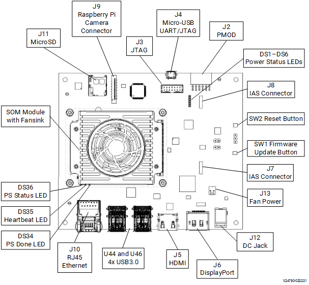
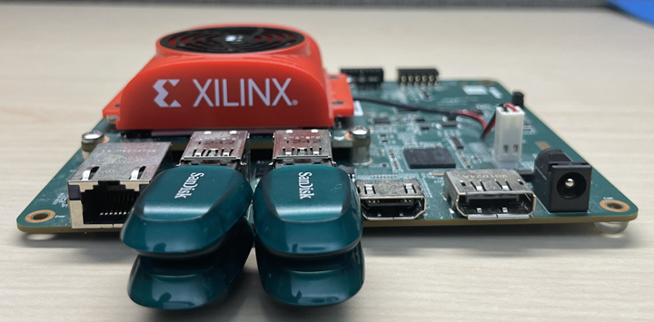
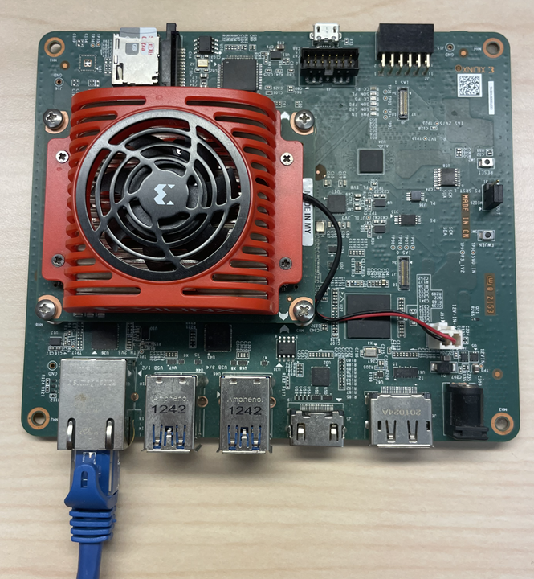
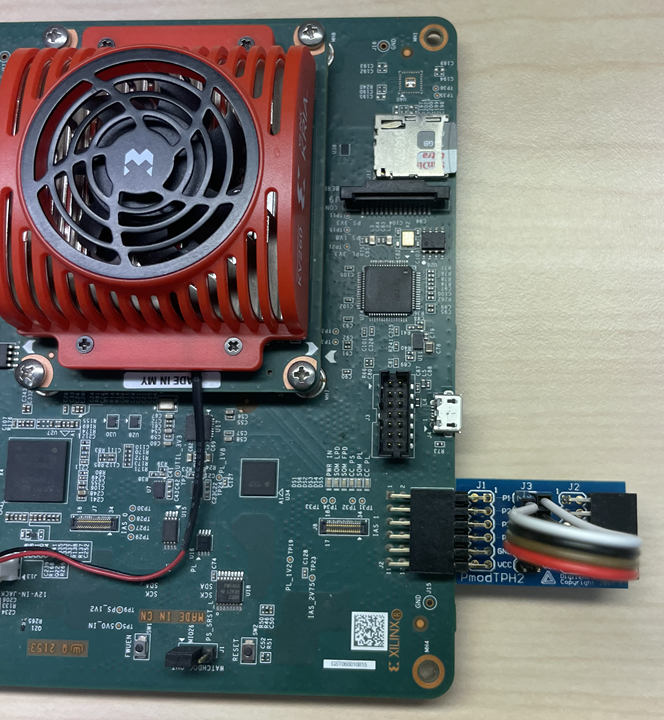
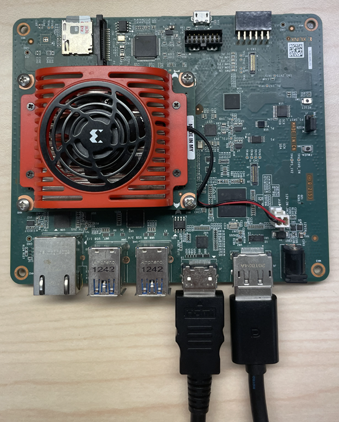
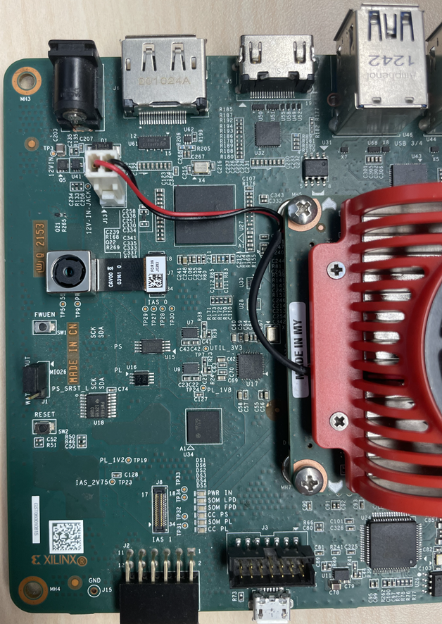
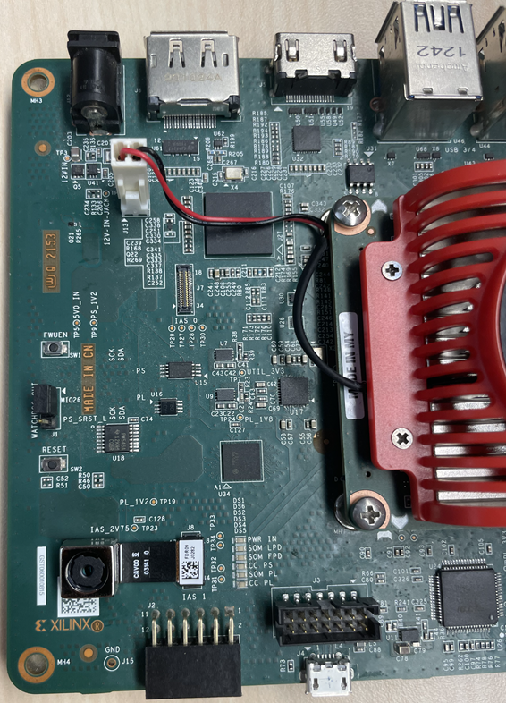
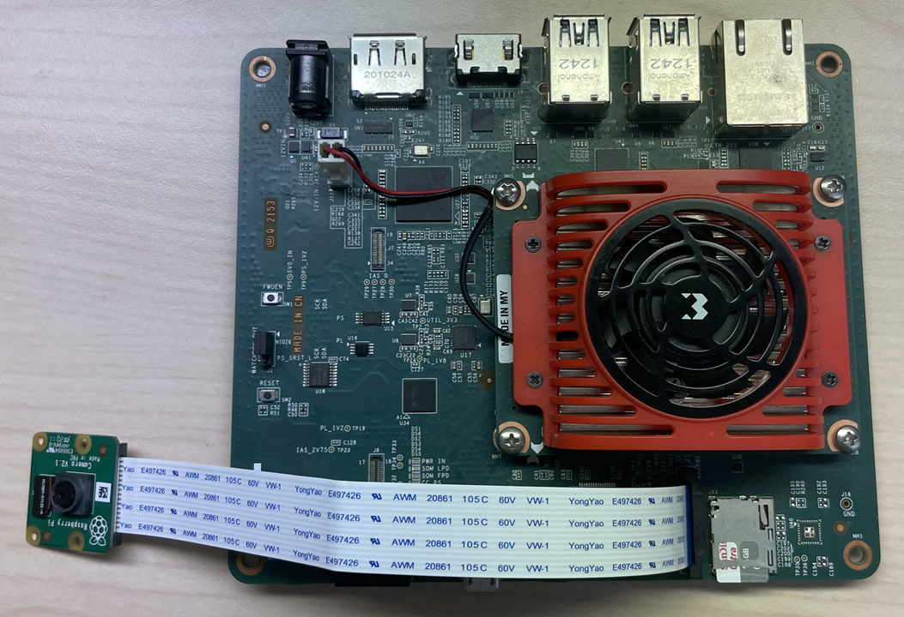
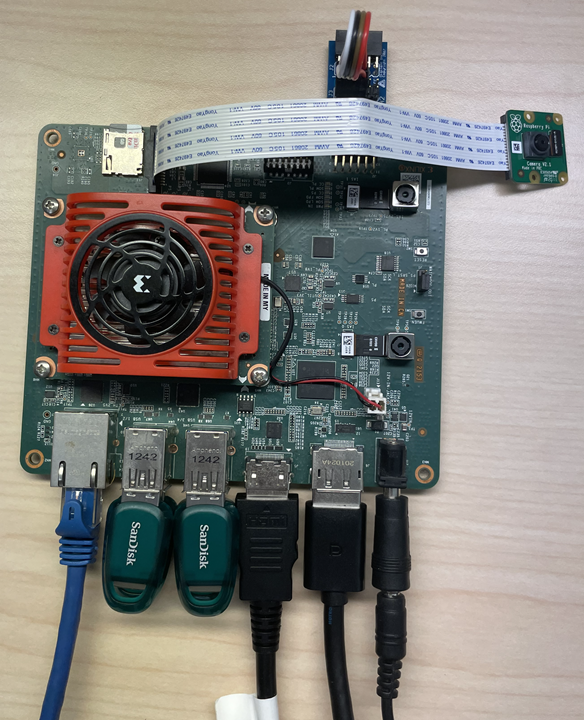

# KV260 BIST Board Setup

## Hardware Requirements

1. KV260 Vision AI Starter Kit
2. KV260 Power Supply & Adapter
3. MicroSD Card
4. Host Machine (Windows or Ubuntu)
5. Four USB Flash Drives
6. One Ethernet Cable
7. One [PMOD TPH2 Test Point Headers](https://digilent.com/reference/pmod/pmodtph2/)
8. Four Female to Female Jumper Wires
9. One [Raspberry Pi Camera Module](https://www.raspberrypi.com/products/camera-module-v2/)
10. Two [Ar1335 Camera Sensors](https://www.xilinx.com/products/som/kria/kv260-vision-starter-kit/basic-accessory-pack.html)
11. 1080P/4K Monitor and Power Supply
12. DisplayPort/HDMI Cable

## Board Setup

This page shows how to set up the KV260 before running the BIST application.

Refer to the KV260 Board and the Interface layout below for connector reference numbers:

Test case mapping to board interfaces:

| Interface                          | External Hardware                                         | Test Module | Test Case                |
|------------------------------------|-----------------------------------------------------------|-------------|--------------------------|
| USB3.0 (Top port) - U44            | USB Flash Drive                                           | Disk        | usb1_read_performance    |
| USB3.0 (Top port) - U44            | USB Flash Drive                                           | Disk        | usb1_write_performance   |
| USB3.0 (Bottom port) - U44         | USB Flash Drive                                           | Disk        | usb2_read_performance    |
| USB3.0 (Bottom port) - U44         | USB Flash Drive                                           | Disk        | usb2_write_performance   |
| USB3.0 (Top port) - U46            | USB Flash Drive                                           | Disk        | usb3_read_performance    |
| USB3.0 (Top port) - U46            | USB Flash Drive                                           | Disk        | usb3_write_performance   |
| USB3.0 (Bottom port) - U46         | USB Flash Drive                                           | Disk        | usb4_read_performance    |
| USB3.0 (Bottom port) - U46         | USB Flash Drive                                           | Disk        | usb4_write_performance   |
| MicroSD port - J11                 | MicroSD Card                                              | Disk        | sd_read_performance      |
| MicroSD port - J11                 | MicroSD Card                                              | Disk        | sd_write_performance     |
| HDMI - J5 and/or Display Port - J6 | 1080p/4k Monitor and Power Cable, Display Port/HDMI Cable | Display     | display_connectivity     |
| HDMI - J5 and/or Display Port - J6 | 1080p/4k Monitor and Power Cable, Display Port/HDMI Cable | Display     | display_modetest         |
| SOM EEPROM                         | None                                                      | EEPROM      | som_eeprom               |
| Carrier Card EEPROM                | None                                                      | EEPROM      | carrier_card_eeprom      |
| RJ45 Ethernet - J10                | Ethernet Cable                                            | Ethernet    | ethernet1_ping           |
| RJ45 Ethernet - J10                | Ethernet Cable                                            | Ethernet    | ethernet1_perf           |
| PMOD - J2                          | PMOD TPH2 Test Header, 4x Female-Female Jumper Wires      | GPIO        | pmod0                    |
| PS I2C Main Bus                    | None                                                      | I2C         | ps_i2c_bus_main          |
| AXI I2C Main Bus                   | None                                                      | I2C         | axi_i2c_bus_main         |
| AXI I2C Channel 0 Bus              | None                                                      | I2C         | axi_i2c_bus_ch0          |
| INA260                             | None                                                      | IIO         | ina260_current           |
| QSPI MTD Device                    | None                                                      | MTD         | qspi_read_write          |
| QSPI MTD Device                    | None                                                      | MTD         | qspi_read_performance    |
| QSPI MTD Device                    | None                                                      | MTD         | qspi_write_performance   |
| PWM   Fan - J13                    | Board Fan                                                 | PWM         | fan                      |
| TPM Hardware                       | None                                                      | TPM         | tpm2_getcap              |
| TPM Hardware                       | None                                                      | TPM         | tpm2_selftest            |
| TPM Hardware                       | None                                                      | TPM         | tpm2_getrandom           |
| TPM Hardware                       | None                                                      | TPM         | tpm2_hash                |
| TPM Hardware                       | None                                                      | TPM         | tpm2_pcrread             |
| TPM Hardware                       | None                                                      | TPM         | tpm2_pcrextend           |
| TPM Hardware                       | None                                                      | TPM         | tpm2_pcrreset            |
| IAS Connector - J7 & AP1302        | AR1335 Sensor                                             | Video       | ar1335_ap1302_ximagesink |
| IAS Connector - J7 & AP1302        | AR1335 Sensor                                             | Video       | ar1335_ap1302_perf       |
| IAS Connector - J7 & AP1302        | AR1335 Sensor                                             | Video       | tpg_ap1302_ximagesink    |
| IAS Connector - J7 & AP1302        | AR1335 Sensor                                             | Video       | tpg_ap1302_perf          |
| Raspberry Pi Camera Connector - J9 | Raspberry Pi Camera Module 2                              | Video       | imx219_filesink          |
| Raspberry Pi Camera Connector - J9 | Raspberry Pi Camera Module 2                              | Video       | imx219_perf              |
| IAS Connector - J8                 | AR1335 Sensor                                             | Video       | ar1335_filesink          |
| IAS Connector - J8                 | AR1335 Sensor                                             | Video       | ar1335_perf              |

The BIST application requires the following hardware setup to run
the full suite of hardware tests:

* USB Flash Drive (x4)

  

  Connect a USB Flash Drive to each of the four USB ports.

* Ethernet Cable (x1)

  

  Connect an Ethernet cable from the Ethernet port on the KV260 to
  the host machine.

* PMOD (x1)

  

  Connect Test PMOD on J2 on the KV260. Connect the pins on PMOD as described below.
  - Connect P1 to P7
  - Connect P2 to P8
  - Connect P3 to P9
  - Connect P4 to P10

  

* Monitor

  

  Before booting, connect a 1080P/4K monitor to the board via either Display Port and/or
  HDMI port.

* AR1335 IAS-ISP Image Sensor Module

  

  Connect the AR1335 Camera Sensor to J7/IAS0 on the KV260.

* AR1335 IAS-direct Image Sensor Module

  

  Connect the AR1335 Camera Sensor to J8/IAS1 on the KV260.

* RaspberryPi Camera v2 module

  

  Connect the Raspberry Pi Camera Module to J9 on the KV260.

* The following image shows a KV260 setup with all the hardware connected.

  

## Next Steps

* [Run the BIST Application](run.md)

Copyright © 2023 Advanced Micro Devices, Inc

<a href="https://www.amd.com/en/corporate/copyright">Terms and Conditions</a>

